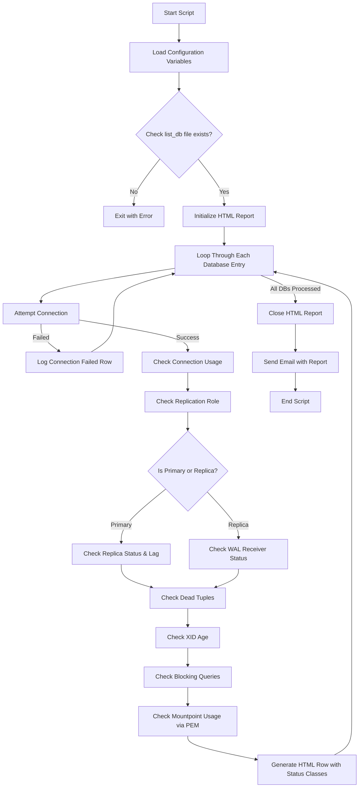

# PostgreSQL Daily Healthcheck Report Script

A comprehensive Bash script that performs automated health checks on PostgreSQL database instances and generates an HTML report with email notification capabilities.

---

## 📁 Project Structure

```
Healthcheck-Report-Consolidation-Server/
├── deploy.bat      # Windows batch script for GitHub deployment
├── hc-report.sh    # Main healthcheck script
├── list_db         # Database instances configuration file
├── README.md       # This documentation
└── result/
    └── daily_health_check_report_sample.html  # Sample output report
```

---

## 🔄 Script Flow Overview



---

## ⚙️ Configuration Variables

| Variable | Description | Default Value |
|----------|-------------|---------------|
| `LIST_DB_FILE` | Path to database list file | `/home/postgres/script/.../list_db` |
| `DB_USER` | PostgreSQL user for target DBs | `pemuser` |
| `DB_PASSWORD` | Database password | `pemuser` |
| `PEM_HOST` | PEM database host | `localhost` |
| `PEM_PORT` | PEM database port | `5433` |

### Threshold Settings

| Threshold | Warning | Alert |
|-----------|---------|-------|
| **Dead Tuples** | ≥ 200,000 | ≥ 1,000,000 |
| **XID Age** | ≥ 250,000,000 | ≥ 1,000,000,000 |
| **Connection Usage** | ≥ 80% | ≥ 90% |
| **Mountpoint Usage** | - | ≥ 70% |
| **Replication Lag** | - | ≥ 10MB |
| **Blocking Queries** | ≥ 1 | ≥ 11 |

---

## 📋 Database List File Format (`list_db`)

The script reads database instances from a CSV-formatted file:

```
HOSTNAME,IP,PORT,DBNAME,DISPLAY_NAME,MOUNTPOINT
```

**Example:**
```
db-server-01,10.0.0.1,5432,production_db,Production DB,/data
db-server-02,10.0.0.2,5432,replica_db,Replica DB,/data
```

---

## 🔍 Health Checks Performed

### 1. Connection Check
- Validates database connectivity
- Calculates connection usage percentage (`current_conn / max_connections`)
- Status: ✅ OK | ⚠️ WARN (≥80%) | 🚨 ALERT (≥90%)

### 2. Replication Status
- Determines if instance is **Primary (Master)** or **Replica (Slave)**
- For Primary:
  - Counts replicas and streaming status
  - Detects `pg_basebackup` sessions
  - Measures replication lag in bytes
- For Replica:
  - Checks WAL receiver connectivity
- Status: 🔵 SYNC | 🔴 UNSYNC | ⏳ DELAY

### 3. Dead Tuples
- Queries `pg_stat_user_tables` for highest dead tuple count
- Reports table with most dead tuples
- Status: ✅ OK | ⚠️ WARN (≥200K) | 🚨 ALERT (≥1M)

### 4. XID Age (Transaction ID Age)
- Queries maximum `age(datfrozenxid)` from `pg_database`
- Indicates need for `VACUUM FREEZE`
- Status: ✅ OK | ⚠️ WARN (≥250M) | 🚨 ALERT (≥1B)

### 5. Blocking Queries
- Counts locks with `NOT granted` status from `pg_locks`
- Status: ✅ OK | ⚠️ WARN (1-10) | 🚨 ALERT (≥11)

### 6. Mountpoint Usage
- Queries PEM database for disk space metrics
- Matches by hostname and mountpoint
- Status: ✅ SAFE | 🚨 ALERT (≥70%)

---

## 📊 Output

### HTML Report
- Generated at: `result/daily_health_check_report_YYYY-MM-DD_HH:MM:SS.html`
- Contains a styled table with all health metrics
- Color-coded status indicators
- See sample report in `result/` folder

### Email Notification
- Sends HTML report as attachment via `mailx`
- Includes summary message to DBA team

---

## 🛠️ Helper Functions

| Function | Purpose |
|----------|---------|
| `human_readable_bytes()` | Converts bytes to KB/MB/GB format |
| `format_large_number()` | Formats numbers (e.g., 1.23B, 5.5M) |
| `run_psql_query()` | Executes queries on target databases |
| `run_psql_query_pem()` | Executes queries on PEM database |

---

## 🚀 Usage

### Running the Healthcheck Script (Linux)

```bash
# Make the script executable
chmod +x hc-report.sh

# Run the healthcheck
./hc-report.sh
```

### Deploying to GitHub (Windows)

```cmd
# Simply double-click deploy.bat or run:
deploy.bat
```

The deploy script will:
1. Initialize Git repository (if needed)
2. Create `.gitignore` for sensitive files
3. Prompt for commit message
4. Push to GitHub repository

### Prerequisites
- `.pgpass` file configured for password-less authentication
- `psql` client installed
- `mailx` configured for email sending
- Access to PEM database for mountpoint metrics

---

## 📧 Email Configuration

```bash
TO_EMAIL="dba@example.com"
FROM_EMAIL="monitoring@example.com"
SUBJECT="[Daily Report] PostgreSQL Database Healthcheck Report"
```

---

## 📝 Status Legend

| Status Class | Color | Meaning |
|--------------|-------|---------|
| `status-ok` | 🟢 Green | Healthy / Normal |
| `status-warn` | 🟡 Yellow | Warning - Monitor |
| `status-alert` | 🔴 Red | Critical - Action Required |
| `status-safe` | 🟢 Green | Safe threshold |
| `repl-primary` | 🔵 Blue | Primary/Master node |
| `repl-replica` | 🟢 Green | Replica/Slave node |
| `repl-unsync` | 🔴 Red | Replication issue |

---

## 📂 Sample Report

A sample HTML report is included in the `result/` folder demonstrating the output format with masked data for security purposes.

---

## 📄 License

Internal tool for PostgreSQL database monitoring - Telkomsigma

---

## 🔗 Repository

**GitHub**: [https://github.com/Athoillah21/Healthcheck-Report-Consolidation-Server](https://github.com/Athoillah21/Healthcheck-Report-Consolidation-Server)
